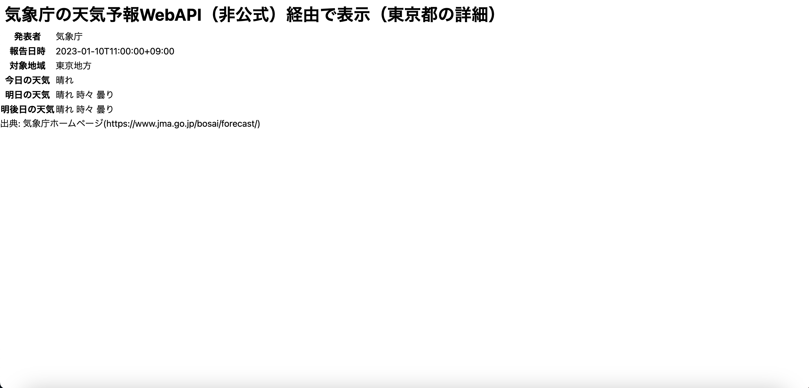

# **気象庁の天気予報JSONファイルを利用した天気予報WebAPI**

# 概要
## 本記事で行うこと
気象庁の天気予報JSONファイルから天気予報情報を取得し、Webサイトに表示する。

- 参考：
    - [気象庁の天気予報JSONファイルをWebAPI的に利用したサンプルアプリ](https://anko.education/apps/weather_api)
    - [気象庁公式の天気予報の情報（JSON）を curl・Node.js で取得し Node.js での処理を試す](https://qiita.com/youtoy/items/932bc48b03ced5a45c71)
    - [気象庁 天気予報](https://www.jma.go.jp/bosai/forecast/)

> **※ この記事を参考に天気予報情報を取得した場合は、表示するページのどこかに、必ず[気象庁ホームページの出典](https://www.jma.go.jp/bosai/forecast/)を記述すること。**

## 気象庁の天気予報WebAPI（非公式）
[気象庁公式の天気予報API（？）が発見 ～Twitterの開発者界隈に喜びの声が満ちる](https://forest.watch.impress.co.jp/docs/serial/yajiuma/1309318.html)

2021年2月未明に、気象庁のWebサイトがリニューアルされ、JSON形式で天気予報情報が取得できるようになった。この情報は、「[政府標準利用規約](https://www.jma.go.jp/jma/kishou/info/coment.html)に準拠してご利用いただける」とのこと。
これに伴い、非公式ではあるが、天気予報WebAPIもどきが使えるようになった。

## 各バージョン
|ツール・アプリケーション|バージョン|
|--|--|
|Laravel9|9.46.0|
|axios|1.2.2|

# 準備
## ViewとControllerの作成
### index.blade.php
取得した天気予報情報を表示するページをweathersフォルダ下（`resorces/views/weathers/index.blade.php`）に作成する。
> ※ npmとviteが有効になっていることが前提（Laravel9の初期設定から有効になっているはず）。
```php
// index.blade.php

<!DOCTYPE html>
<html lang="{{ str_replace('_', '-', app()->getLocale()) }}">
    <head>
        <meta charset="utf-8">
        <meta name="viewport" content="width=device-width, initial-scale=1">

        <title>Laravel</title>
        <link href="https://fonts.bunny.net/css2?family=Nunito:wght@400;600;700&display=swap" rel="stylesheet">
        @vite('resources/js/api.js') // api.jsでAPIを叩く（viteでJSファイルを読み込む）
        // @vite(['resources/css/app.css', 'resources/js/api.js']) // TailwindCSSを入れていたらこちら
        
    </head>
    <body>
        <h1 class="text-3xl font-bold m-2">気象庁の天気予報WebAPI（非公式）経由で表示（東京都の詳細）</h1>
            <table>
                <tr id="publishingOffice">
                    <th>発表者</th>
                    <td></td>
                </tr>
                <tr id="reportDatetime">
                    <th>報告日時</th>
                    <td></td>
                </tr>
                <tr id="targetArea">
                    <th>対象地域</th>
                    <td></td>
                </tr>
                <tr id="today">
                    <th>今日の天気</th>
                    <td></td>
                </tr>
                <tr id="tomorrow">
                    <th>明日の天気</th>
                    <td></td>
                </tr>
                <tr id="dayAfterTomorrow">
                    <th>明後日の天気</th>
                    <td></td>
                </tr>
            </table>
        <p>出典: 気象庁ホームページ(<a href="https://www.jma.go.jp/bosai/forecast/">https://www.jma.go.jp/bosai/forecast/</a>)</p>
    </body>
</html>
```

### WeatherController.php
以下のコマンドを打ち、`app/Http/Controllers/WeatherController.php`を作成する。
```console
$ php artisan make:controller WeatherController
```
作成したコントローラーに、取得した天気予報情報を表示するページ(`resorces/views/weathers/index.blade.php`)を返す記述をする。
```php
// WeatherController.php
<?php

namespace App\Http\Controllers;

use Illuminate\Http\Request;

class WeatherController extends Controller
{
    public function index(){
        return view('weathers/index');
    }
}
```
### web.php
`route/web.php`に取得した天気予報情報を表示するURLを記述する。
```php
// web.php
<?php

use Illuminate\Support\Facades\Route;
use App\Http\Controllers\WeatherController; // 追加忘れずに

// 気象庁の天気予報WebAPI経由で表示(東京都の概要)
Route::get('/weathers', [WeatherController::class, 'index']);
```

## axiosの導入
### axiosとは
今回はJSONデータを取得するために、axiosを用いる。
axiosはJavaScriptのライブラリであり、HTTP通信を介したデータの取得や送信を簡単に行うことができる。

### axiosのインストール
```console
$ npm install axios --save # --saveでpackage.jsonにも一応反映させる
```

## APIを叩くファイルの作成
`resorces/js/api.js`を作成し、ここでaxiosを用いてAPIを叩く。
 とりあえず動いているか確認したいので、コンソールに適当な文字を出力しておく。
```js
// api.js
console.log("This is api.js.");
```

この際、bladeファイル（`weathers/index.blade.php`）にviteでjavascript（`api.js`）を読み込ませたいので、`vite.config.js`に以下を追記する。
```js
// vite.config.js

import { defineConfig } from 'vite';
import laravel from 'laravel-vite-plugin';

export default defineConfig({
    plugins: [
        laravel({
            // 'resources/js/api.js'を追記
            input: ['resources/css/app.css', 'resources/js/app.js', 'resources/js/api.js'],
            refresh: true,
        }),
    ],
});
```
こうすることで、bladeファイルに`@vite('resources/js/api.js')`と書くだけで、JSファイルを読み込ませることができる。
> ※ 参考：[アセットの構築（Vite）](https://readouble.com/laravel/9.x/ja/vite.html)

以上の準備を完了し、最後にコンソールで`npm run build`する。
以下のようなページとコンソールが表示されたらOK。


# 天気予報を取得する
## 使用API
`https://www.jma.go.jp/bosai/forecast/data/forecast/{各地域のコード}.json`
上記APIを叩くと、以下画像のようなJSON形式のデータを取得することができる（今回は、東京(地域コード: 13000)の天気予報情報を取得）。
> ※ 各地域のコードは[こちら](https://www.jma.go.jp/bosai/common/const/area.json)から探せる。


上記画像の"0"に3日間の天気予報、"1"に7日間の天気予報が入っている。
今回は3日間の天気を表示したいため"0"を開くと、以下の画像の様な中身となっている。

上記画像から、weatherCodesが各日の天気に対応していることがわかる（0: "100"が今日(2023/1/10)、1: "101"が明日(2023/1/11)、2: "101"が明後日(2023/1/12)）。これは、timeDefinesを見ると明らかである。
> ※ weathersに天気そのものが書かれているが、7日間ではweatherCodeしか書かれていない。こちらにも対応できるように、今回もweatherCodeを取得して天気を表示する。

このとき、weatherCodesをそのまま表示されても理解できないため、weatherCodesを天気に直す処理を行う必要がある。
今回の場合では、100は「晴れ」、101は「晴れ時々曇り」と表示させたい。
> ※ weatherCodesは、[気象庁の週間天気のページ](https://www.jma.go.jp/bosai/forecast/)でDevelopToolのコンソールから`Forecast.Const.TELOPS`と入力すると全て見れる。

この処理には以下の2通りが考えられる。
1. APIを叩く処理を書くJS（今回で言うapi.js）に、switch文でweatherCodesと天気の対応付けを全通り書く。
1. ローカルのJSONファイルにweatherCodesと天気の対応付けを書き、APIを叩く処理を書くJSでJSONファイルを読み込んで都度検索する。

1の方法ではAPIを叩く処理を書くJSファイルが冗長となるため、今回は2の方法を採用した。
> ※ ただし、2の方法はローカルのJSONファイルを呼び出すために都度リクエストを行っているため、処理の重さを考慮すると妥当かどうかは定かではない。

## APIを叩く
[使用API](#使用API)で取得したJSONファイルの中身を参考にして、実際に`api.js`にaxiosでAPIを叩く処理を記述する。
```js
// api.js

import axios from 'axios'; // axiosをインポート

// 東京(130000)の予報を取得（気象庁のjsonデータ）
// response.data[0]の方に3日間、response.data[1]の方に7日間の天気予報が入っている。
const url = axios.get("https://www.jma.go.jp/bosai/forecast/data/forecast/130000.json")
            .then((response) => {
                // axiosは"response.data"に取得データが入ってくる
                console.log(response.data);
                // 発表者と報告日時の情報を画面に書き出す
                document.getElementById("publishingOffice").lastElementChild.textContent = response.data[0].publishingOffice;
                document.getElementById("reportDatetime").lastElementChild.textContent = response.data[0].reportDatetime;
                // 特定地域の情報を画面に書き出す
                document.getElementById("targetArea").lastElementChild.textContent = response.data[0].timeSeries[0].areas[0].area.name;
                weatherShow("today", response.data[0].timeSeries[0].areas[0].weatherCodes[0]);
                weatherShow("tomorrow", response.data[0].timeSeries[0].areas[0].weatherCodes[1]);
                weatherShow("dayAfterTomorrow", response.data[0].timeSeries[0].areas[0].weatherCodes[2]);
            })
            .catch((error)=>{ // 念の為のエラー処理
                console.log("error: ", error);
            });

// ローカルのJSONファイルを介して、weatherCodesと天気を対応付け（2の方法）
function weatherShow(id, code){
    axios.get("/data/weather.json") // public内に入れたファイルはこのようにパスを書くことができる（Laravel9のみ）
        .then((response) => {
            // response.data.find((w) => w.weatherCode == code)でJSONファイルを介して、weatherCode（変数code）に該当するweatherを取得する
            document.getElementById(id).lastElementChild.textContent = response.data.find((w) => w.weatherCode == code).weather;
        })
        .catch((error)=>{
            console.log("error: ", error);
        });

    // switch直書きでも良いが、api.jsが長くなる（1の方法）
    // switch(code){
    //     case "100":
    //         return "晴れ";
    //     case "101":
    //         return "晴れ時々曇り";
    //     ...
    //     default:
    //         return "その他";
    // }
} 
```
weatherCodesと天気の対応付けを行うJSONファイルは、`public/data/weather.json`として作成し、以下のように記述する。
```json
[
    {
        "weatherCode": "100",
        "weather": "晴れ"
    },
    {
        "weatherCode": "101",
        "weather": "晴れ 時々 曇り"
    }
]
```
> ※ ビルド（`npm run build`）をすると、resorces下のファイルは全て`public/build`下に再構築される。public下が本番環境で実際に表示されるファイル（一般公開へのアクセスを許すファイル群（アセットと呼ばれる））となるため、画像や各データファイルはここに配置する必要がある。
> - 参考：[ディレクトリ構造
> ](https://readouble.com/laravel/9.x/ja/structure.html)

以上を完了し、最後にコンソールで`npm run build`する。
以下のようなページが表示されたらOK。
